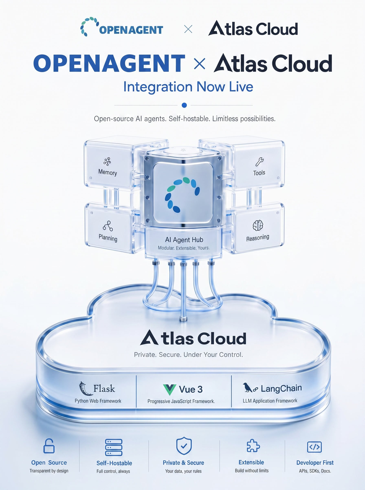

<a id="readme-top"></a>

<div align="center">
  

  <p align="center">
    YuxinAI (钰心AI): a device-agent and partner co-creation platform.
    <br />
    Quart + LangChain/LangGraph backend, Vue 3 workspace, visual workflows, device tools, skills, avatars, and OpenAPI delivery.
  </p>

  <p align="center">
    <strong>Sponsored by <a href="https://www.atlascloud.ai/?utm_source=github&utm_medium=link&utm_campaign=yuxin-ai">Atlas Cloud</a></strong>
  </p>

  <p align="center">
    <a href="https://openllm.cloud">Visit Website</a>
    ·
    <a href="https://s.apifox.cn/c76bd530-fd50-429c-94cc-f0e41c2675d1/api-305434417">API Docs</a>
    ·
    <a href="README_ZH.md">中文文档</a>
    ·
    <a href="https://github.com/NILL-HUB/yuxin-ai">GitHub</a>
  </p>

  <p align="center">
    
    
    
    
    
    <a href="https://deepwiki.com/NILL-HUB/yuxin-ai"></a>
  </p>
</div>

## Table of Contents

- [About The Project](#about-the-project)
- [Architecture](#architecture)
- [Built With](#built-with)
- [Getting Started](#getting-started)
- [Usage](#usage)
- [Project Structure](#project-structure)
- [Documentation](#documentation)
- [Testing](#testing)
- [Contact](#contact)
- [Acknowledgments](#acknowledgments)

## About The Project


> Current direction: 钰心AI is being repositioned as a device-agent and partner co-creation platform. The sections below describe the current implementation baseline, which is being refactored.

YuxinAI (钰心AI) is a platform that combines device-level agent control, skill packaging, digital avatars, and a partner revenue ecosystem. The repository currently contains a Quart backend, Celery workers, a Vue 3 frontend, visual workflow authoring, tool governance, model routing, skills, memory, billing, and OpenAPI-based delivery.

What the current codebase already supports:

- Use the home assistant to route user requests to published public agents through A2A, or turn natural-language requirements into new AI app creation flows.
- Build and manage AI apps from a dedicated workspace with draft, publish, analysis, version comparison, and prompt comparison flows.
- Design workflows visually with nodes for LLMs, tool calls, dataset retrieval, code execution, HTTP requests, branching, text processing, template transforms, and structured parameter extraction.
- Manage datasets, upload documents, inspect segments, and connect retrieval to agents and workflows.
- Browse public apps, tools, and workflows through store-style views.
- Expose published apps over REST and SSE through `POST /api/openapi/chat`.

## Architecture

<a href="https://github.com/user-attachments/assets/f6bdccf2-a6ff-4924-b68b-ec4d3581796e">
  
</a>

Click the diagram to view the full-resolution architecture image.

### Built With

- AI framework and orchestration: LangChain, LangGraph, workflow orchestration, tool calling, A2A delegation, skills, memory
- Knowledge and retrieval: RAG, semantic retrieval, full-text retrieval, hybrid retrieval, Weaviate, FAISS
- Backend: Python, Quart, SQLAlchemy, Celery, Socket.IO, Redis, PostgreSQL
- Frontend: Vue 3, JavaScript / TypeScript, Vite, TailwindCSS, Pinia, Vue Flow, Arco Design
- Infrastructure and delivery: Docker Compose, Nginx, OpenAPI, SSE
- Model integrations: OpenAI, Atlas Cloud, DeepSeek, Grok, Google, Moonshot, Tongyi, Wenxin, Ollama, Zhipu

### Provider Ecosystem

<p align="center">
  
</p>

- Atlas Cloud is now available as an OpenAI-compatible provider with `ATLASCLOUD_API_KEY` and `ATLASCLOUD_API_BASE`.
- Official website: [Atlas Cloud](https://www.atlascloud.ai/?utm_source=github&utm_medium=link&utm_campaign=yuxin-ai)
- Integration docs: [https://www.atlascloud.ai/docs](https://www.atlascloud.ai/docs)

<p align="right">(<a href="#readme-top">back to top</a>)</p>

## Getting Started

### Prerequisites

- Docker 20.10+
- Docker Compose 2.x
- 8 GB+ RAM recommended for the full stack
- Access to at least one supported model provider API key

### Installation

1. Clone the repository.

   ```bash
   git clone https://github.com/NILL-HUB/yuxin-ai.git
   cd yuxin-ai
   ```

2. Create the runtime environment file.

   ```bash
   cp api/.env.example api/.env
   ```

3. Review the minimum required settings in `api/.env`.

   - `JWT_SECRET_KEY`
   - `POSTGRES_PASSWORD`
   - `REDIS_PASSWORD`
   - `WEAVIATE_API_KEY`
   - `VITE_API_PREFIX`
   - At least one provider key such as `OPENAI_API_KEY`, `ATLASCLOUD_API_KEY`, `DEEPSEEK_API_KEY`, or `DASHSCOPE_API_KEY`

4. Start the Docker stack.

   ```bash
   cd docker
   docker compose up -d --build
   ```

5. Open the local services.

   | Service | URL | Notes |
   | --- | --- | --- |
   | Frontend | http://localhost:3000 | Vue 3 web UI |
   | API | http://localhost:5001 | Quart REST API |
   | Nginx | http://localhost | Reverse proxy |

### Local Development

Backend:

```bash
cd api
pip install -r requirements.txt
flask run --port 5001
```

Frontend:

```bash
cd ui
npm install
npm run serve
```

Vite serves the frontend on port `5173` by default. The frontend configuration resolves the API base from `VITE_API_PREFIX`, and local development commonly proxies `/api` to the Flask backend.

Useful commands:

```bash
cd api
pytest
```

```bash
cd ui
npm run type-check
npm run lint
npm run build
npm run test:unit -- --run
```

<p align="right">(<a href="#readme-top">back to top</a>)</p>

## Usage

### 1. Home Assistant Experience


Use the home page as the default assistant entry point to route user questions to the most relevant published public agents through A2A, or describe a new idea in natural language and trigger AI app creation. The same surface also supports multi-turn chat, suggested prompts, image upload, and audio input.

### 2. App Workspace and Deep Research


The app workspace is the main work area for an AI app, not a standalone settings page. The left side handles model, prompt, and capability bindings. The right side is used for live debugging, execution traces, and result checks. In the current codebase, the README term `Deep Research` maps to the deep thinking mode behind `enable_deep_thinking`.

Key capabilities:

- Configuration and version management: manage model changes, prompt logic, drafts, publishing, version comparison, prompt comparison, and app duplication in one place.
- Capability integration: bind plugins, MCP, Skills, child Agent apps, workflows, and datasets through a single workspace.
- Complex task execution: with `Deep Research` enabled, the app can break work into steps and coordinate bound capabilities across a longer execution chain.
- Sandbox and artifact output: support script execution, code handling, file generation, and attachment export for tasks that need concrete outputs.
- Debugging and result verification: use the right-side panel to run real conversations and inspect deep execution timelines, task state, produced artifacts, and final results.

### 3. Visual Workflow Editor


Author workflows with nodes such as LLM, tool, dataset retrieval, code, HTTP request, template transform, text processor, variable assigner, parameter extractor, if/else, start, and end.

### 4. Dataset and Retrieval


Create datasets, upload documents, inspect segments, and wire retrieval nodes into workflows or AI apps for knowledge-enabled behavior.

### 5. OpenAPI Delivery


Publish an app and call it over `POST /api/openapi/chat` with standard or streaming responses, including support for multi-turn conversation identifiers.

<p align="right">(<a href="#readme-top">back to top</a>)</p>

## Project Structure

```text
.
├── api/          # Flask backend, services, handlers, tasks, migrations, tests
├── ui/           # Vue 3 frontend, routes, views, components, tests
├── docker/       # Docker Compose stack, nginx, postgres init, deployment config
├── README.md     # English project overview
└── README_ZH.md  # Chinese project overview
```

## Documentation

- [README_ZH.md](README_ZH.md) - Chinese project overview
- [api/README.md](api/README.md) - backend notes
- [ui/README.md](ui/README.md) - frontend notes
- [docker/README.md](docker/README.md) - Docker stack details
- [api/.env.example](api/.env.example) - environment reference

## Testing

The repository already includes automated backend and frontend tests.

- Backend: `cd api && pytest`
- Frontend unit tests: `cd ui && npm run test:unit -- --run`
- Frontend type check: `cd ui && npm run type-check`
- Frontend build validation: `cd ui && npm run build`

## Contact

- Project Link: https://github.com/NILL-HUB/yuxin-ai
- Website: https://openllm.cloud
- API Docs: https://s.apifox.cn/c76bd530-fd50-429c-94cc-f0e41c2675d1/api-305434417
- DeepWiki: https://deepwiki.com/NILL-HUB/yuxin-ai

## Acknowledgments

- Thanks to Atlas Cloud for supporting 钰心AI.
- Special thanks to Rui Yang and Haoyu Wang (Johns Hopkins University) for responsibly reporting a Host Header poisoning issue in the built-in tool icon URL construction and helping improve the security of this project.

<p align="right">(<a href="#readme-top">back to top</a>)</p>
