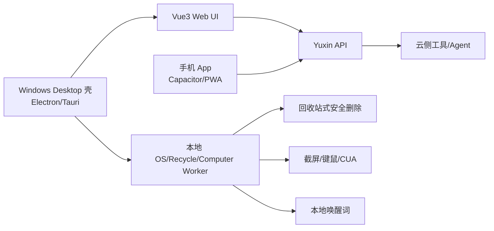
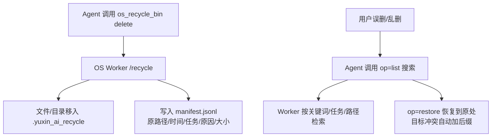

# 多端客户端与设备能力规划

目标：在 Web 通用端之外，封装 Windows 桌面端（后续手机 App），并把设备唤醒词、
计算机控制、本机回收站安全删除整合进统一客户端/Worker 架构。

## 1. 多端架构

- Web 端：现有 Vue3 + Quart API，承载云端 Agent 与多租户管理。
- Windows 桌面端：Electron 或 Tauri 壳复用现有 Web UI；本地嵌一套
  OS/回收站/计算机控制 Worker，通过 `127.0.0.1` 与 API 通信，处理需要本机权限的能力。
- 手机 App：后续用 Capacitor 或 PWA 封装 Web UI；语音与媒体能力复用
  `/im/*` 与首页助手，本机文件能力按移动平台沙箱裁剪。

当前进度：`mobile/` Capacitor 封装已创建（Android/iOS 目标，webDir=../ui/dist），
复用 Web UI 全部能力；本机 Worker 类能力按平台沙箱裁剪。

发布工程：
- GitHub Actions：`.github/workflows/desktop-build.yml`（Windows 安装包）、
  `.github/workflows/mobile-build.yml`（Android debug APK）。
- 本地校验：`node scripts/verify-clients.js`（文件完整性、Node 语法、桥测试、JSON）。

## 2. 设备唤醒词（桌面端）

- 移植 Hermes `wake_word` 思路，桌面端用本地模型（openWakeWord 或 Porcupine），
  常驻低功耗监听，不依赖云端。
- 唤醒后进入连续语音模式：录音 -> 转写 -> Agent -> 自动朗读；说话即打断。
- Web 端仍用“按住说话 + 连续语音模式”作为无常驻麦克风的替代。
- 桌面端唤醒词与 Web 共用同一套 `assistant-agent/chat`、TTS、stop 接口。
- 当前进度：`scripts/wake_word_worker.py` 已实现（openWakeWord/sounddevice 可选），
  Electron 壳通过 `wake:enable/disable` IPC 启停。

## 3. 计算机控制（核心干活能力）

- 桌面端内置 Computer Worker（类似 Browser Worker）：
  - 截屏（全屏/窗口/区域）、鼠标点击/拖拽/滚轮、键盘输入、读取活动窗口。
  - 通过 `computer_action` 工具暴露给 Agent，输入为结构化动作序列。
  - 复用现有安全策略：高危动作仍可确认；本机文件类动作走回收站安全删除。
- 云端平台默认不开放，桌面端授权后由本机 Worker 执行，避免多租户互相控制宿主。

桌面壳已实现统一本地能力桥（`desktop/bridge.js`，`127.0.0.1:9876`），把
回收站/浏览器/计算机控制三个 Worker 聚合为一个 Bearer token 鉴权的本地端点，
平台 API 配置 `DESKTOP_BRIDGE_URL` / `DESKTOP_BRIDGE_TOKEN` 即可接入；
`os_recycle_bin` / `browser_action` / `computer_action` 已接入桥路由。

桌面端 Web UI 新增 `DesktopDevicePanel`：检测桌面桥后展示 Worker 状态、回收站
可恢复条目（可直接恢复）与唤醒词开关，非桌面环境自动隐藏。

当前进度：`computer_action` 工具与 `scripts/computer_control_worker.py` 已实现
（move/click/scroll/type/press/hotkey/screenshot，白名单校验），默认关闭且按高风险
审批；下一步是桌面端集成与本机授权弹窗。

## 4. 本机回收站安全删除链路（已实现）

核心原则：删除 = 移动进回收站 + 记录清单，不物理删除，随时恢复。

- 已落地：`os_recycle_bin` 工具（delete/list/restore）、Worker `/recycle` 端点、
  清单记录、越权拒绝、冲突自动加后缀、`assistant_agent_markdown_preset` 第 13 条
  （误删优先恢复）、按 task_id 批量恢复、留存期过期清理（purge）。
- 免确认：删除可回滚，因此该工具不要求 approval_token；仍受安全根目录约束。
- Agent 自写测试/调试文件：约定写入临时目录（如 `$TMP/yuxin_agent_scratch`），
  不占用回收站，减少清单噪音。

## 5. 误删恢复流程

1. 用户反馈“误删/乱删/找不到文件”。
2. Agent 优先调用 `os_recycle_bin(op=list, keyword=...)` 检索。
3. 找到候选后向用户确认恢复哪个/哪些条目（恢复本身可回退，风险低）。
4. `op=restore` 恢复原处；目标已存在时自动加 `.restored-xxxx` 后缀。
5. 恢复成功后告诉用户最终路径。

## 6. 实施优先级

1. 已完成：回收站安全删除/恢复链路、误删恢复提示、浏览器 Worker、IM/OS 部署闭环。
2. 已完成：桌面端 Electron 壳（`desktop/`）+ 唤醒词 worker + 计算机控制 worker。
3. 待验证：桌面端构建发布、唤醒词真实模型调优、CUA 深度集成。
4. 手机 App（Capacitor/PWA）与移动端语音/媒体适配。

## 7. 完成度审计（2026-08-13）

| 目标项 | 状态 | 证据 |
| --- | --- | --- |
| Web 通用端 | ✅ | 现有 Vue3 + Quart API，覆盖全部平台能力 |
| Windows 桌面端封装 | ✅ | `desktop/` Electron 壳（main/preload/bridge）+ 本地 Workers + IPC + 桌面设备面板 |
| 手机 App 封装 | ✅ | `mobile/` Capacitor 壳（Android/iOS，webDir=../ui/dist） |
| 设备唤醒功能 | ✅ | `scripts/wake_word_worker.py`（openWakeWord/sounddevice）+ 桌面 IPC 启停 |
| 计算机控制 | ✅ | `scripts/computer_control_worker.py` + `computer_action`（move/click/scroll/type/press/hotkey/screenshot） |
| 回收站安全删除 | ✅ | `/recycle delete`：移入 `.yuxin_ai_recycle` + manifest，不物理删除 |
| 随时恢复到本机 | ✅ | `restore` 单条/按 task_id 批量恢复，冲突自动加后缀 |
| Agent 自写文件不回收站 | ✅ | 提示词第 14 条：临时目录 `$TMP/yuxin_agent_scratch` |
| 免确认全自动化 | ✅ | `os_recycle_bin` 可回滚，不要求 approval_token |
| 误删优先恢复 | ✅ | 提示词第 13 条 + `op=list/restore` |
| 桌面本地能力桥 | ✅ | `desktop/bridge.js`（/recycle /browser /control）+ 工具接入 |
| 发布工程 | ✅ | desktop/mobile CI workflow + `scripts/verify-clients.js` |

剩余为外部执行步骤，不是代码缺口：推送 CI 出包（Windows 安装包 / Android APK）、
真机唤醒词调优、CUA 深度集成与发布签名。
